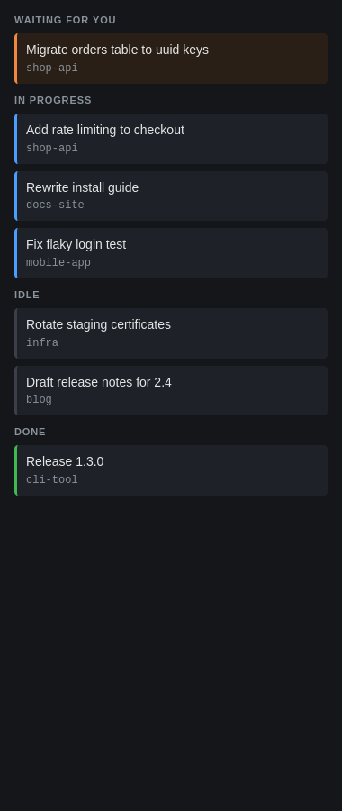
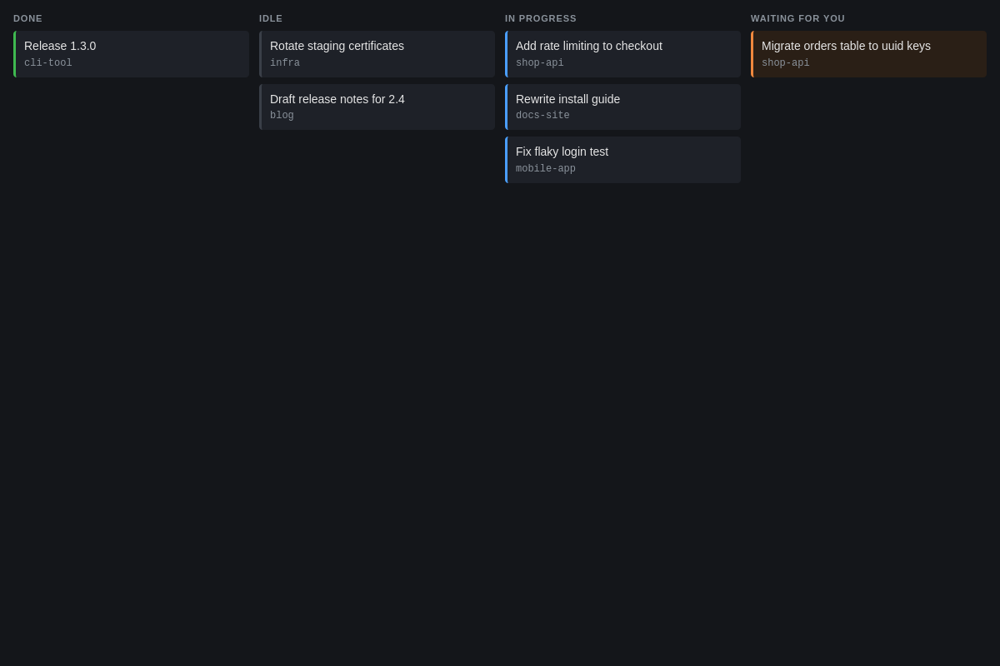

# herdr-dash

A kanban board for your [herdr](https://github.com/herdrdev/herdr) agents.
Every agent pane becomes a card in one of four columns: waiting for you,
in progress, idle, done. Click a card to focus that pane in herdr.

One Python file, standard library only. No install step.



In a wider window the sections become columns:



## Run

```sh
./herdr-dash.py
```

Open http://127.0.0.1:7655. The board connects to herdr's socket at
`~/.config/herdr/herdr.sock`; set `HERDR_SOCKET_PATH` to use another one.
herdr doesn't need to be running first. The board retries until it is.

## How it works

herdr already classifies each pane as idle, working, blocked or done. The
board subscribes to herdr's pane events.

A card that changed while you weren't looking at its pane gets a purple
outline until you focus it. A card whose session has exited dims for half a
minute, then disappears.

## Remote herdr servers

If you run herdr on other machines too, register each one as an ssh target:

```sh
./herdr-board register my-new-machine        # host from ~/.ssh/config
./herdr-board unregister my-new-machine
./herdr-board list
```

Each host gets its own tab.

The registry is a plain text file at `~/.config/herdr-dash/remotes`, one
target per line, read on every tick. Editing it by hand works too.

## Desktop launcher

`herdr-board` with no arguments starts the board if needed and opens it in
its own window. It expects [hello-browser](https://github.com/svandragt/hello-browser),
a small single-site browser for Linux. Without it, run `herdr-dash.py` and
open the URL in any browser.

## Licence

MIT. See `LICENSE`.
